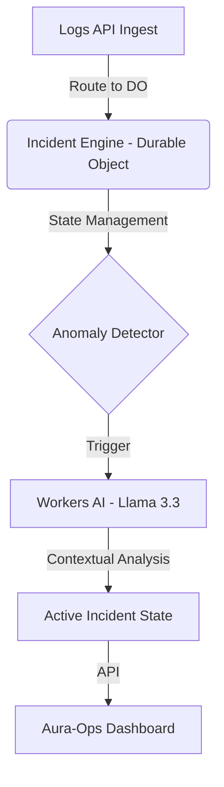
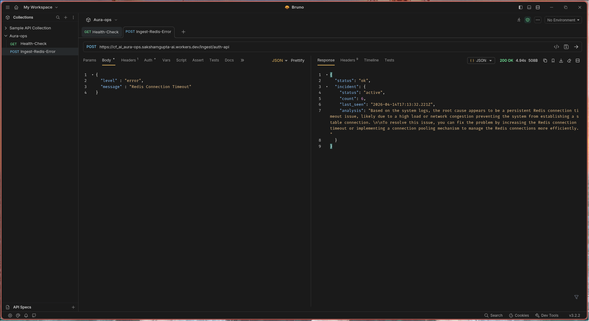

# Aura-Ops: Edge-Native Incident Copilot

**Aura-Ops** is a stateful, edge-native incident detection and debugging engine. Built entirely on **Cloudflare Workers** and **Durable Objects**, it shifts observability from a centralized, high-latency model to an atomic, near-zero-latency architecture at the edge.

---

## 🏗️ Architecture
Aura-Ops avoids the "chat with PDF" trap by treating AI as a *component* of a distributed system.



### Core Innovations
*   **Atomic State Coordination:** Uses **Durable Objects** to maintain per-service incident state. This ensures that log aggregation is consistent and race-condition-free, even in a globally distributed environment.
*   **Edge-Native Intelligence:** Logic and AI inference occur within the same Cloudflare data center as the incoming logs, eliminating cross-region egress latency.
*   **Type-Strict Infrastructure:** Built with strict TypeScript contracts (no `any`), mirroring the rigor of production-grade systems engineering.

---

## 🚀 Getting Started

1. **Install Dependencies:**
   ```bash
   bun install
   ```
2. **Deploy:**
   ```bash
   bun run deploy
   ```
3. **Ingest a Log:**
   ```bash
   curl -X POST https://aura-ops.workers.dev/ingest/auth-api \
     -H "Content-Type: application/json" \
     -d '{"level": "error", "message": "Redis connection timeout"}'
   ```

---
## 🛠️ Proof of Concept
The following shows the engine processing an incident in real-time. Aura-Ops receives the raw logs, performs anomaly detection, and triggers the Workers AI Copilot to provide an actionable fix:



## 🛤️ Roadmap & Future Improvements

Aura-Ops is currently a high-performance PoC. The following architecture upgrades are prioritized:

1.  **Persistent Storage Hook:** Implement **R2 (Object Storage)** integration to archive incident snapshots for long-term audit trails, as Durable Object memory is ephemeral.
2.  **Alerting Integrations:** Build a dedicated `webhooks` service within the engine to push `active` incident alerts to Slack/PagerDuty.
3.  **Log TTL & Pruning:** Introduce an automated "Time-To-Live" (TTL) mechanism to ensure the Incident Engine doesn't exceed memory limits during high-traffic outages.
4.  **Vector Store Integration:** Leverage **Vectorize** to perform RAG (Retrieval-Augmented Generation) on historical logs, allowing the copilot to identify patterns across months of data rather than just the current session.

---

## 📜 System Prompts
We treat AI as a deterministic component. The copilot uses a scoped system prompt to maintain SRE-grade precision:

> *"You are an SRE expert. Analyze these system logs. Identify the root cause and provide one immediate, actionable remediation step. Focus on infrastructure insights, not generic advice."*

---

## ⚖️ Built with
- **Cloudflare Workers** (Compute)
- **Durable Objects** (State)
- **Workers AI** (Inference)
- **Hono** (Routing)
- **TypeScript** (Safety)

Built with a focus on production-readiness, Aura-Ops is designed to be a drop-in component for any modern observability stack, providing real-time incident insights directly at the edge.

## 🧑‍💻 Contributing
Contributions are welcome! Please fork the repository and submit a pull request with your improvements.
## 📄 License
This project is licensed under the MIT License. See the [LICENSE](LICENSE) file for details.

## Built with love ❤️ by [Saksham Gupta](https://github.com/0xsaksham)
