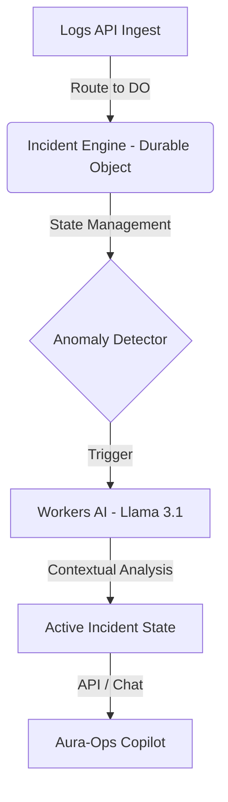
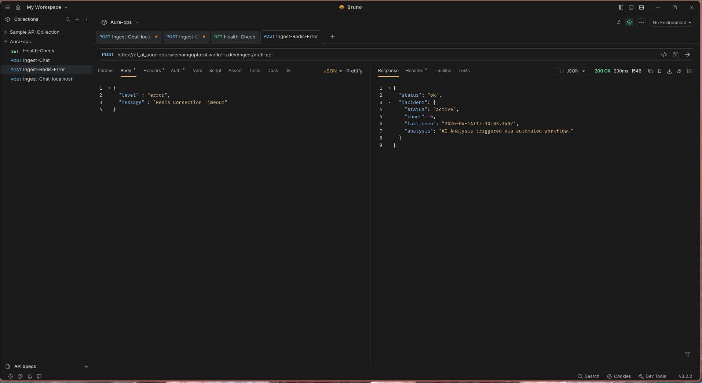
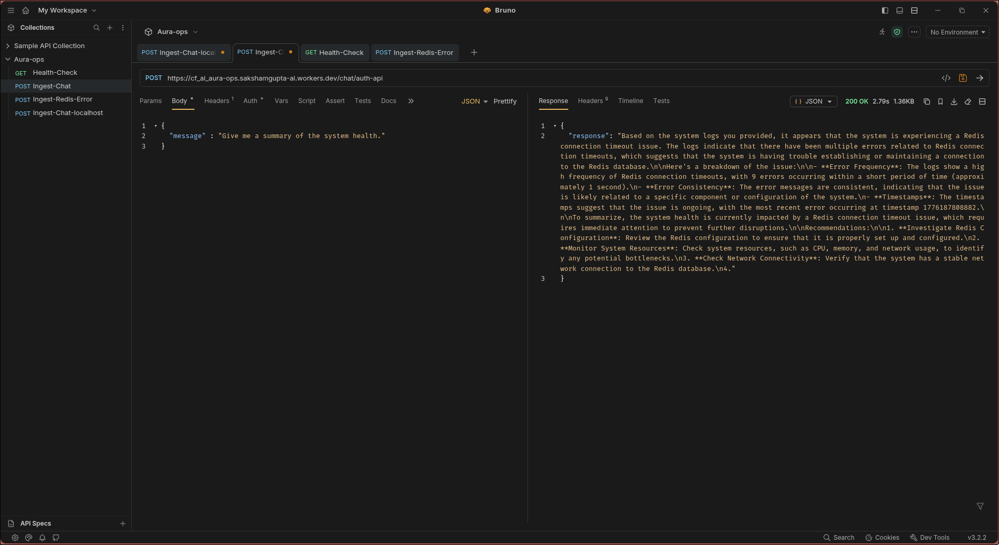

# Aura-Ops: Edge-Native Incident Copilot

**Aura-Ops** is a stateful, edge-native incident detection and debugging engine. Built entirely on **Cloudflare Workers** and **Durable Objects**, it shifts observability from a centralized, high-latency model to an atomic, near-zero-latency architecture at the edge.

---

## ⚡ Live Demo (Test in 30 Seconds)

To see the **Durable Object** state coordination and **Workers AI** analysis in action without touching a terminal:

1. **Trigger Incident:** [**Click here to simulate a 6-error failure on 'auth-api'**](https://cf_ai_aura-ops.sakshamgupta-ai.workers.dev/simulate/auth-api)
   * *Logic: This programmatically sends 6 logs, triggers the anomaly threshold, and invokes the AI SRE analysis instantly.*

2. **Chat with the Engine:** Ask the Copilot about the system state using the chat endpoint:
   ```bash
   curl -X POST https://cf_ai_aura-ops.sakshamgupta-ai.workers.dev/chat/auth-api \
     -H "Content-Type: application/json" \
     -d '{"message": "What happened to the auth-api and how do I fix it?"}'
   ```

---

## 🏗️ Architecture
Aura-Ops avoids the "chat with PDF" trap by treating AI as a *deterministic component* of a distributed system.



### Core Innovations
*   **Atomic State Coordination:** Uses **Durable Objects** to maintain per-service incident state. This ensures that log aggregation is consistent and race-condition-free, even in a globally distributed environment.
*   **Edge-Native Intelligence:** Logic and AI inference occur within the same Cloudflare PoP as the incoming logs, eliminating cross-region egress latency.
*   **Type-Strict Infrastructure:** Built with strict TypeScript contracts (no `any`), mirroring the rigor of production-grade systems engineering.

---

## 🛠️ Proof of Concept
The engine processes incidents in real-time by receiving raw logs, performing anomaly detection, and triggering the Workers AI Copilot to provide actionable fixes.

### 1. Incident Detection & Analysis


### 2. Contextual AI Chat (RAG)
Sent via Bruno (see `tests/` folder for collection):


---

## 🚀 Getting Started

1. **Install Dependencies:**
   ```bash
   bun install
   ```
2. **Deploy:**
   ```bash
   bun run deploy
   ```
3. **Project Documentation:**
   * **[Engineering Journal & AI Prompts](./PROMPTS.md)**: A detailed log of architectural decisions, AI prompts, and debugging hurdles (TLS mismatches, Stream consumption fixes).

---

## 🛤️ Roadmap & Future Improvements

Aura-Ops is a high-performance PoC. Future architecture upgrades include:

1.  **Persistent Storage Hook:** Implement **R2** integration to archive incident snapshots for long-term audit trails.
2.  **Alerting Integrations:** Build a dedicated `webhooks` service to push `active` alerts to Slack/PagerDuty.
3.  **Vector Store Integration:** Leverage **Vectorize** to perform RAG on historical logs for long-term pattern recognition.

---

## ⚖️ Built with
- **Cloudflare Workers** (Compute)
- **Durable Objects** (Stateful Memory)
- **Workers AI** (Llama 3.1-8b-instruct)
- **Hono** (Routing)
- **TypeScript** (Safety)

Built with love ❤️ by [Saksham Gupta](https://github.com/0xsaksham)
